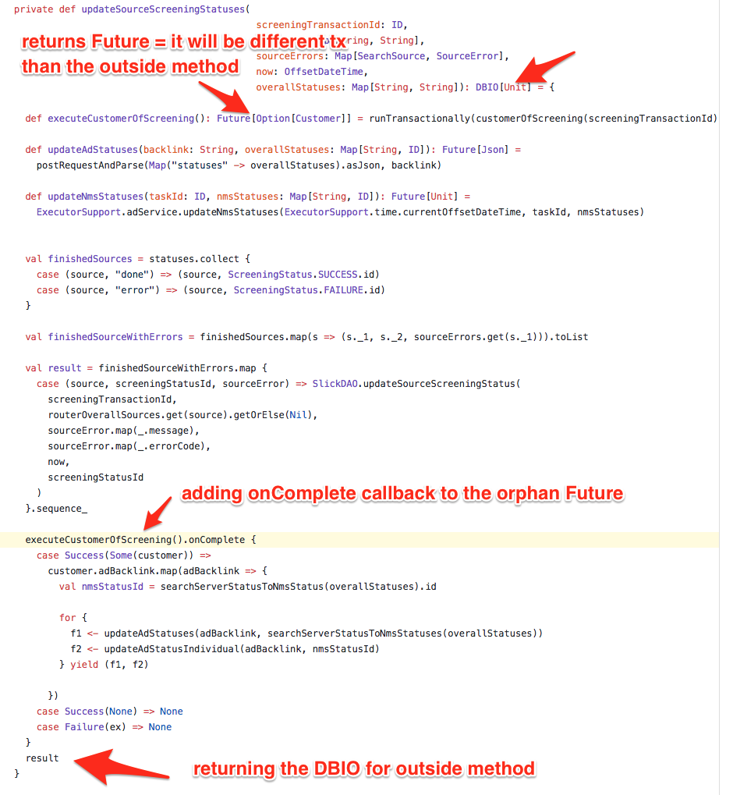

# Scala guidelines

Content:

* [Basics](#basics)
* [Types](#types)
* [Option](#option)
* [For-comprehensions](#for-comprehensions)
* [Future](#future)
* [Slick 3](#slick-3)
* [Sangria](#sangria)
* [Misc](#misc)


## Basics

1. If you are not more comfortable and faster coding in `Scala` than in `Java`, `Javascript` or `Python` you are doing it wrong. Study. Types should help you not make you struggle. And also learn how to use your IDE.

2. Have as much logic as possible in pure functions. Do all side effect as early as possible or wait with then as long as possible and have heart of your code pure. Single impure function in mostly pure function poisons it all. There are three ways how to battle side effects (from the 
* pass value calculated by side effect to pure function
* pass pure function to side effect function and call it when needed
* pass the result of pure function to side effect function where you interpret it

3. Read [The Neophyte's Guide to Scala](http://danielwestheide.com/scala/neophytes.html)

## Types

### Prefer pure functions with easy type signatures

```scala
def notifyXYService(input: Input): Notification
// is most of the time better than
def notifyXYService(numberOfEvent: Int, name: String, initiator: String): Notification
```

```scala
def notifyXYService(input: Input): Notification
// is most of the time better than
def notifyXYService(input: Input): Future[Notification]
```

```scala
def notifyXYService[F[_]: Monad](input: Input): F[Notification]
// is most of the time better than
def notifyXYService(input: Input): Future[Notification]
```

```scala
// the worst thing ever - Unit
def notifyXYService(numberOfEvent: Int, name: String, initiator: String): Unit
```

### Do not do methods on containers (Lists, Maps, Futures etc.), rather use map

* small example
```scala
def searchServerStatusToNmsStatuses(status: Map[String, String]): Map[String, ID] = ???
searchServerStatusToNmsStatuses(mapWithShit)
// convert to
def searchServerStatusToNmsStatus(status: String): ID = ???
mapWithShit.map(searchServerStatusToNmsStatus)
```

* the same example but bigger, look how much code is saved

the shitty code:
```scala
def searchServerStatusToNmsStatuses(status: Map[String, String]): Map[String, ID] = {
    status.mapValues(_ match {
      case "done" => NmsStatus.READY.id
      case "error" => NmsStatus.FAILED.id
      case "not done" => NmsStatus.RUNNING.id
    })
}

def searchServerStatusToNmsStatus(status: Map[String, String]): NmsStatus = {
    val allStatuses: List[ID] = status.collect {
        case (source, "done") => ScreeningStatus.SUCCESS.id
        case (source, "error") => ScreeningStatus.FAILURE.id
        case (source, "not done") => ScreeningStatus.PENDING.id
    }.toList
    
    
    val nmsStatusId = if (allStatuses.contains(ScreeningStatus.FAILURE.id)) {
      NmsStatus.FAILED
    } else if (allStatuses.contains(ScreeningStatus.PENDING.id)) {
      NmsStatus.RUNNING
    } else {
      NmsStatus.READY
    }
    nmsStatusId
}
```
fixed code:
```scala
def statusToNmsStatus(status: String): NmsStatus = status match {
    case "done" => NmsStatus.READY
    case "error" => NmsStatus.FAILED
    case "not done" => NmsStatus.RUNNING
}

def searchServerStatusToNmsStatus(status: Map[String, String]): NmsStatus = {
    val allStatuses = status.mapValues(statusToNmsStatus).toList
    
    if (allStatuses.contains(ScreeningStatus.FAILURE))
      NmsStatus.FAILED
    else if (allStatuses.contains(ScreeningStatus.PENDING))
      NmsStatus.RUNNING
    else
      NmsStatus.READY
}
```

### Separate pure functions (functions working with plain data)

shitty code (data conversion bundled with sending them):
```scala
def updateResults(labels: Seq[DataLabelAggregated]): Future[Unit] =
  customer.adBacklink.map { adBacklink =>
    val payload = labels.map(l => Map(l.name -> l.count.toString))
    val updatePayload = Map(
      "labelsAndStatus" -> Map(
        "labels" -> payload
      )
    ).asJson
    postRequestAndParse(updatePayload, adBacklink).map(_ => ())
  }
  .getOrElse(Future.successful(()))
```

better code (data conversion as standalone pure function):
```scala
def labelsToJson(labels: Seq[DataLabelAggregated]): Json =
      Map(
        "labelsAndStatus" -> Map(
          "labels" -> labels.map(l => Map(l.name -> l.count.toString))
        )
      ).asJson
```

### Do not use primitive types
* this can leads to bugs. When you have function `updateCaseState(caseId: Long, userId: Long, newStatusId: Long)` you can easy make a mistake and write  `updateCaseState(userId, caseId, newStatusId)` instead of `updateCaseState(caseId, userId, newStatusId)`. It is hard to make mistake when function is defined like this `updateCaseState(case: Case, user: User, newStatus: Status)`. This is always trade of as it might be hard to get the instance of than object but iuf you already have it keep it as long as you can. 2 primitives and 1 class in method signature si better than 3 primitives.

shitty code:
```scala
def getTaskDataForTask(taskId: ID, dataTypeId: ID): DBIO[Seq[TaskData]] =
    TaskDataTable
        .filter(task => task.taskId === taskId && task.dataTypeId === dataTypeId)
        .sortBy(_.createdAt)
        .result
```

better code (look only dataType was changed as we have constants in code, to get task we would need to read it from db):
```scala
def getTaskDataForTask(taskId: ID, dataType: DataType): DBIO[Seq[TaskData]] =
  TaskDataTable
      .filter(task => task.taskId === taskId && task.dataTypeId === dataType.id)
      .sortBy(_.createdAt)
      .result
```

### Do not code things twice build upon existing functions

better code (postRequestAndParse working with `Json` is more general so we can build upon it and create function working with classes)
```scala
def postRequestAndParse[Request: Encoder, Response: Decoder: ClassTag](req: Request, url: String): Future[Response] =
  postRequestAndParse(req.asJson, url).flatMap(_.as[Response].fold(
    _ => Future.failed(new Exception(s"Error parsing response from $url to ${Utils.className[Response]}.\nResponse: $a")),
    Future.successful
  ))

def postRequestAndParse(req: Json, url: String): Future[Json] = ???
```

## Option

### No `.getOrElse(None)`
`.getOrElse(None)` means that you probably forget to use `.flatMap` somewhere

shitty code:
```scala
val a: Option[A] = ???
def aToB(a: A): Option[B] = ???

val b: Option[B] = a.map(aToB).getOrElse(None)
```

better code:
```scala
val a: Option[A] = ???
def aToB(a: A): Option[B] = ???

val b: Option[B] = a.flatmap(aToB)
```

### No `Option.isDefined` check

shitty code:
```scala
val getUserPrimaryGroup: Option[User] => Option[UserGroup] = (user) =>
  if (user.isDefined)
    uamDao.getUserPrimaryGroup(user.get.id)
  else None
```

better code:
```scala
val getUserPrimaryGroup: Option[User] => Option[UserGroup] = (user) =>
  user.map(u => uamDao.getUserPrimaryGroup(u.id))
```

shitty code:
```scala
if (opt.isDefined) println(opt.get)
```

better code:
```scala
opt foreach println
```

### `Option` like `Iterable`

```scala
Option(1) ++ Option(2) ++  None ++ Option(3)
// gives you Iterable(1, 2, 3)
```

```scala
List(1) ++ Option(2) ++  None ++ Option(3)
// gives you List(1, 2, 3)
```  
### OptionT
Do you need to combine `Option` fast circuit with functions returning `Futures`? Use OptionT then. It works like Option but it wraps `Future[Option[A]]` or other monad

```scala
(for {
  data <- OptionT.fromOption[Future](ctx.value.data)
  task <- OptionT.liftF(ctx.ctx.adService.getTask(ctx.value.taskId))
  customerId <- OptionT.fromOption[Future](task.flatMap(_.customerId))
  customer <- OptionT.liftF(ctx.ctx.kycService.getCustomer(customerId))
} yield {
  parseData(customer.get.entityTypeId, ctx.value.dataTypeId, data)
}).value
```

## For-comprehensions

`For-comprehension`s are translated to `map`, `flatMap` and `withFilter`. [Here](https://docs.scala-lang.org/tutorials/FAQ/yield.html) you can find more about them.

This `for-comprehension`
```scala
for(x <- a; y <- b; z <- c) yield f(x, y, z)
```
is translated to
```scala
a.flatMap(x => b.flatMap(y => c.map(z => f(x, y, z))))
```
Types of `a`, `b`, `c` must have the same "wrapper" type e.g. `Future`, `DBIO`.
Types of `x`, `y`, `z` are "unwrapped" type e.g. if `a` is `Future[String]`, `x` will be `String`.
If you need to work with "unwrapped" types use `=` instead of `<-` e.g. `u = stringToUpper(a)`. 
Result of `for-comprehension` has also the same "wrapper" type.

If you do not want to write semicolons at the end use `{}` e.g.
```scala
for {
  x <- a
  y <- b
  z <- c
} yield f(x, y, z)
```
 

### Empty `for-comprehension`

Use `for-comprehension` only if you have multiple values packed ion the same box (`Option`, `Future`, `Task` etc.) and they depen on each other

shitty code:
```scala
def createTaskWithData(task: Task, now: OffsetDateTime, taskData: Json): Future[Task] =
  runTransactionally(
    for {
      task <- SlickDAO.createTaskWithData(task, now, taskData)
    } yield task
  )
```

better code:
```scala
def createTaskWithData(task: Task, now: OffsetDateTime, taskData: Json): Future[Task] =
  runTransactionally(SlickDAO.createTaskWithData(task, now, taskData))
```

### `Applicative` instead of `for-comprehension`
When values do not depend on each other only the result `Applicative` is better than `for-comprehension` because it is weaker

shitty code:
```scala
implicit val jwtPayloadDecoder: Decoder[JWTPayload] = Decoder.instance(c =>
    for {
      primaryGroup <- c.get[String]("primary-group")
      groupMember <- c.get[List[String]]("group-member")
      name <- c.get[String]("name")
      pid <- c.get[String]("pid")
    } yield JWTPayload(primaryGroup, groupMember, name, pid)
  )
```

better code:
```scala
implicit val jwtPayloadDecoder: Decoder[JWTPayload] = Decoder.instance(c =>
    (
      c.get[String]("primary-group"),
      c.get[List[String]]("group-member"),
      c.get[String]("name"),
      c.get[String]("pid")
    ).map4(
     JWTPayload
    )
  )
```

## Future

### Too early Future 
If you ever need something to wrap in Future do is as late as possible, when you really need future. This way method has clearer types and it can be used in more cases

shitty code:
```scala
private def getAdBacklink(customer: CustomerView): Future[Option[String]] =
  Future.successful(customer.adBacklink)

private def updateDispositionsIfAd(customer: CustomerView, overview: OverviewSummary): Future[Option[Json]] =
    for {
        maybeAdBacklink <- getAdBacklink(customer)
        result <- maybeAdBacklink match {
        case None => Future.successful(None)
        case Some(adBacklink) => updateDispositions(adBacklink, overview)
      }
    } yield result
```

better code:
```scala
private def getAdBacklink(customer: CustomerView): Option[String] = customer.adBacklink

private def updateDispositionsIfAd(customer: CustomerView, overview: OverviewSummary): Future[Option[Json]] =
    for {
        maybeAdBacklink <- Future.successful(getAdBacklink(customer))
        result <- maybeAdBacklink match {
            case None => Future.successful(None)
            case Some(adBacklink) => updateDispositions(adBacklink, overview)
        }
} yield result
```

even better code without the `for-comprehension`
```scala
  private def updateDispositionsIfAd(customer: CustomerView, overview: OverviewSummary): Future[Option[Json]] =
    customer.adBacklink.flatTraverse(updateDispositions(_, overview))
```

### Too many `Future`s

Do not wrap in `Future` just for sake wrapping it. When only one method returns Future use map on it instead of `flatMap` or `for-comprehension`

shitty code:
```scala
def getDispositions(taskId: ID): Future[Option[OverviewSummary]] = {
    for {
      taskDataSeq <- getTaskDataForTask(taskId, DataType.UPDATE_DISPOSITIONS_REQUEST)
      maybeHead <- Future.successful(taskDataSeq.headOption)
      nmsResult <- Future.successful(maybeHead.flatMap(_.data).flatMap(_.as[OverviewSummary].toOption))
      maybeRiskTopics <- Future.successful(nmsResult)
    } yield (maybeRiskTopics)
  }
```

better code:
```scala
def getDispositions(taskId: ID): Future[Option[OverviewSummary]] =
    getTaskDataForTask(taskId, DataType.UPDATE_DISPOSITIONS_REQUEST).map(
      _.headOption.flatMap(_.data).flatMap(_.as[OverviewSummary].toOption)
    )
```

### Do not `Future[Unit]`
Always return something from the `Future`. You might not find that it failed and it can type check even if there is a bug
[https://lustforge.com/2016/04/12/future-unit-and-stupid-scala-tricks/]

### Do not orphan `Future`s
Do not orphan `Future`s include them in the final result of the function otherwise you can not act on their failures. It is very different than calling sync method.
Note that if you switch `Future` to cats-effects IO or monix/scalaz Task or slick's DBIO and do not include it in the result it will never be executed.

Also do not use `onComplete` for serious tasks.


shitty code (`updateSourceScreeningStatuses` will not run in the same transaction as `executeCustomerOfScreening` even though it is inner method of it)





### Do not use `Future[Future[A]]`
This type is not what you really want

shitty code (runtime type of `updateNmsStatus` is `Future[Future[TaskData]]`):
```scala
def updateNmsStatus(time: OffsetDateTime, taskId: ID, nmsStatusId: ID): Future[Unit] =
  Future.successful(updateNmsStatusInDb(time, taskId, nmsStatusId))

private def updateNmsStatusInDb(time: OffsetDateTime, taskId: ID, nmsStatusId: ID): Future[TaskData] = ???
```

better code:
```scala
def updateNmsStatus(time: OffsetDateTime, taskId: ID, nmsStatusId: ID): Future[TaskData] = ???
```
  

### Traverse
Use `traverse` to execute optional `Future`.
More generally G is `Applicative`, T is `Traverse`
```scala
def traverse[G[_]: Applicative, A, B](fa: F[A])(f: A => G[B]): G[F[B]]
```
if `f` returns `Option` as well and you do not care if the input to `f` or it's putput was empty you can use this as well
```scala
def flatTraverse[G[_], A, B](fa: F[A])(f: A => G[F[B]])(implicit G: Applicative[G], F: FlatMap[F]): G[F[B]] =
```
There are lot more cool methods in `Traverse` type class take a look.

shitty code:
```scala
def doA: Future[A] = ??? 
def doB(a: A): Future[Option[B]] = ??? 
def doC(b: B): Future[C] = ???

for {
a <- doA
b <- doB(a)
_ <- b.optionalValue.map(doC(_)).getOrElse(Future.succestull(C.empty()))
} yield a
```

better code (`Option` is `Traverse`, `Future` is `Applicative`):
```scala
import cats.instances.future._
import cats.instances.option._
import cats.syntax.traverse._

def doA: Future[A] = ??? 
def doB(a: A): Future[Option[B]] = ??? 
def doC(b: B): Future[C] = ???

for {
a <- doA
b <- doB(a)
_ <- b.optionalValue.traverse(doC)
} yield a
```

## [Slick 3](http://slick.lightbend.com)

### Use `DBIO.sequence`
shitty code:
```scala
private def createUserGroups(userGroups: Seq[UserGroup]): DBIO[UserGroup] = {
  val first = createUserGroup(userGroups.head)
  userGroups.tail.foldLeft(first : DBIO[UserGroup])((x, y) => x andThen createUserGroup(y))
}
```
better code
```scala
private def createUserGroups(userGroups: Seq[UserGroup]): DBIO[Seq[UserGroup]] =
    DBIO.sequence(userGroups.map(createUserGroup))
```
  val getUserPrimaryGroup: Option[User] => Option[UserGroup] = (user) =>
    if (user.isDefined) uamExecutor.execute(
      uamDao.getUserPrimaryGroup(user.get.id)
    ) else None
    
### Never `DBIO.flatMap(_ => ???)`
Prefer `DBIO` methods which do not take `ExecutionContext`. Methods like `andThen`, `andFinally`, `seq` or `sequence` are batched on db thread so it is faster and also type signatures and you do not need to have implicit in scope.  

shitty code:
```scala
TasksTable
  .filter(condition)
  .map(_.kycRiskTopics)
  .update(kycRiskTopics)
  .flatMap(_ =>
      TasksTable
        .filter(condition)
        .result
        .headOption
  )    
```

better code:
```scala
TasksTable
  .filter(condition)
  .map(_.kycRiskTopics)
  .update(kycRiskTopics) andThen
    TasksTable
    .filter(condition)
    .result
    .headOption    
```

## [Sangria](http://sangria-graphql.org)


## Misc

### Prefer `map`/`flatMap` to `fold`/`reduce` if possible

shitty code:
```scala
val payload = labels.foldLeft(List[Map[String, String]]()) { (acc, label) =>
    acc ++ (label.map(f))
}
```

better code:
```scala
val payload = labels.flatMap(_.map(f))
```

### Use enum library
I like `org.julienrf.enum`. Then you can easily get all values or convert between `String` and enum class. You can use it e.g.to make json encoders/decoders

code:
```scala
// this is important as default circe sealed trait mapping looks like "ASC":{} instead of just "ASC"
def enumDecoder[A: Enum]: Decoder[A] = Decoder.instance(hc =>
  hc.value.asString.flatMap(Enum[A].decode(_).toOption).map(Right(_))
    .getOrElse(DecodingFailure(s"Can't parse: ${hc.value.noSpaces}", hc.history).asLeft))

// this is important as default circe sealed trait mapping looks like "ASC":{} instead of just "ASC"
def enumEncoder[A: Enum]: Encoder[A] = Encoder.instance(Enum[A].encode(_).asJson)

sealed trait SortDirection
object SortDirection {

  object ASC extends SortDirection
  object DESC extends SortDirection

  implicit val enum = Enum.derived[SortDirection]
  
  implicit val decoder: Decoder[SortDirection] = enumDecoder
  implicit val encoder: Encoder[SortDirection] = enumEncoder
}
```

### Do not use blocks (if not necessary)

Blocks can lead to errors as it is executed once and it's result is last statement. Also if you forget to include `DBIO` in the result of a block it will never be executed.

Block is not a [function](http://daily-scala.blogspot.sk/2010/05/return-value-of-block.html).

```scala
var count = 0                                                                                                                   
val l = List(1,2,3,4).map{count += 1;_ + 1}
// l is List(2, 3, 4, 5)
// count is still 1
```

shitty code:
```scala
def getResolvedCustomersCount(userId: ID)(implicit ec: ExecutionContext): DBIO[Int] = {
  CustomerTable
    .filter(t => t.userId === userId && t.actionTakenId.isDefined)
    .length
    .result
}
```

better code:
```scala
def getResolvedCustomersCount(userId: ID)(implicit ec: ExecutionContext): DBIO[Int] =
  CustomerTable
    .filter(t => t.userId === userId && t.actionTakenId.isDefined)
    .length
    .result
```

### Never `return`
More on that [here](https://tpolecat.github.io/2014/05/09/return.html)

shitty code:
```scala
def plusOne(i: Int): Int = return i + 1 
```

better code:
```scala
def plusOne(i: Int): Int = i + 1 
```

### `NoStackTrace` when you do not need stack trace

If exception is clean you don't have to have stack trace

better code:
```scala
throw new NodeNotFoundException(s"There is no task with target id $targetId") with NoStackTrace
```
