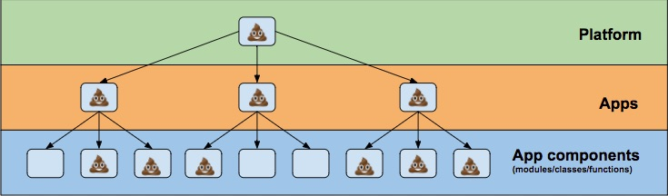

# SW design principles

## Make it simple
* watch [Simple made easy](https://www.infoq.com/presentations/Simple-Made-Easy) 
* read [12-factor apps](https://12factor.net/)

## Fighting tech debt

There are three levels of tech debt. If you fix higher level it has way bigger impact than fixing the lower.

### Levels of tech debt

1) highest level is overall platform architecture (how the apps communicate, how they are deployed, how to do logging/monitorig etc.)
2) middle level is architecture of a single app - layers of app, if we use streams or actors and what are our policies to use them, programming language, libraries etc.
3) and the lowest level is actual code in new features (which is still important but has the least effect)

There is popular `law of falling shit` in management.

This also holds for SW development. If the overall architecture is not set right or not there at all, you can't easily fix it by writing nicer code. E.g. microservice architecture where services calls each other instead of having service bus. All of them needs to handle failover or store messages until they can send them to receiving service. The code in application itself can be nice but this is unnecessary complexity. Another such thing is not having aggregated logs or common monitoring over the whole platform. To fix architecture problems you will probably need to touch many if not all applications and it will take a lot of resources usually weeks or even months. I worked on platform where the application itself were shitty but we hand nice lambda architecture and centralised logging and monitoring and working with it was fine and we knew what is happening in the platform.

Second level of shit is architecture of single application. If you need to fix it you will probably touch many modules/classes/methods/functions. But you touch just single app so it is easier to fix than platform architecture bug usually you fix this in matter of days or weeks.

Easiest and the least important is the code itself. It is easier to fix than application architecture bug, you can refactor it usually in matters of hours when you are working on a new feature.

  

### How to fix them
1) Discuss and confront overall architecture and deployments. Should be company wide initiative
2) Should be solved per app. There are some general guidelines which can be shared between projects tough. If code adhers to principles can be checked at code review but solely code reviews are not enough for this level. Sometime the right answer would be not to implment feature at all or implement different one so this one will not be needed. 
3) This is the only one that can be fixed by solely code reviews. The code principles can also be shared. Probably except how to use the of libraries as product engineering team team for sure use different libs than system engineering or machine learning team. level 3) can be attacked in code reviews. also level 2) can be attacked in code reviews but first it has to be written somewhere
