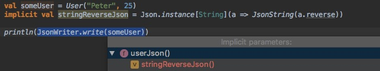

# Type classes and patterns

* **type class** - pattern to extend classes
* **type class** = trait with type parameter + implicit implementations as type class instances
* implicits can be used for [many more things](http://www.lihaoyi.com/post/ImplicitDesignPatternsinScala.html) than type classes
* resolved (all instances are known) in **compile time**
* in the example is `Json` type class with instances for `String` and `Double`
* usually type class instances are in **instances** package e.g. `import cats.instances._`
```scala
trait Json[A] {
    def toJson(a: A): JSModel
}

implicit val jsonString = new Json[String]{
    def toJson(a: String) = JSString(a)
}

implicit val jsonDouble = new Json[Double]{
    def toJson(a: Double) = JSNumber(a)
}
```
## Dependent type classes
```scala
//implicit def jsonOption[A](implicit jsonA: Json[A]) =
// this is the same as

implicit def jsonOption[A: Json] = 
    new Json[Option[A]]{
        def toJson(a: Option[A]) = a.map(implicitly[Json[A]].toJson).getOrElse(JSNull)
    }
```

## it can also depend on different type class
```scala
// we can automatically have type class Json for type A
// if we have Enum type class for it 
implicit def jsonEnum[A: Enum] = new Json[A]{ ... }
```

## Instance pattern
* creates type class instances
```scala
object Json {
    def instance[A](f: A => JSModel) =
        new Json[Option[A]]{
          def toJson(a: A) = f(a)
        }
}

implicit val intJson = Json.instance[Int](JSNumber(_))
```

## Summoner pattern
* summons type class instance to scope
```scala
object Json {
    def apply[A : Json] = implicitly[Json[A]]
}

implicit def jsonOption[A: Json] = 
    new Json[Option[A]]{
        def toJson(a: Option[A]) = a.map(Json[A].toJson).getOrElse(JSNull)
    }
```

## Ops pattern
* implicit conversion to make type class look like methods on object
* usually implicit conversions are in **syntax** package e.g. `import cats.syntax.all._` or `import cats.syntax.option._` to be able to use `.some` and `import cats.syntax.either._` to be able to use `.asLeft` and `.asRight`
```scala
object Json {
    implicit class Ops[A : Json](a: A) {
      def toJson = Json[A].toJson(a)
    }
}
 
import Json.Ops
  
Json[String].toJson("asdfasdf")  
// you can write the same now as   
"asdfasdf".toJson
1.toJson
```

## Companion object with instances pattern
* bring type class instances always to scope when importing object
```scala
case class User(id: ID, firstName: String, lastName: String, active: Boolean)
 
object User {
    implicit val json = Json.instance[User](u => ???)
} 

import User
// now is also type class Json[User] in scope
```

## Low priority instances

* default instances for type classes are put to LowPriorityInstance trait so they do not collide with others and are taken only when some higher priority instance is not in scope

```scala
trait LowPriorityConverters {
  implicit def defaultConverter[A] = Converter[A].instance(_ => "No converter written")   
}

object Converters extends LowPriorityConverters {

  implicit val stringConverter = Converter[String].instance(_)  
}

import Converters._

// implicits do not collide on String and stringConverter is taken
"some string".convert
1.convert
```

## Aux pattern
// TODO

## InstanceOf pattern
instanceOf type classes scalaz 8 https://www.slideshare.net/jdegoes/scalaz-8-a-whole-new-game
// TODO

## MTL style / finally tagless

* instead of writing monad transformers (data types), write type class parametrised with `F[_]` to extract the effect. It is not just more [flexible but also faster](http://degoes.net/articles/effects-without-transformers).
* here we have `MonadState` type class, monad transformer `StateT` implements as well as other data types can

```scala
trait MonadState[F[_], S] extends Monad[F] { self =>
  def get: F[S]
  def put(s: S): F[Unit]
}

def runApp[F[_]](implicit F: MonadState[F, AppState]): F[Unit] =
  for {
    state <- F.get
    ...
    _ <- F.put(state.copy(...))
    ...
  } yield ()
```

## Existentials

* if you want to specify that you want a type with type class but you do not care about the actual type - e.g. you want to pass db statement creation function mulitple paramaters as a list and they all have to have SQLParam type class 
* read more [here](https://www.cakesolutions.net/teamblogs/existential-types-in-scala)

```scala
// data TCBox tc = forall a. tc a => TCBox a
sealed trait TCBox[TC[_]] {
  type T
  val value: T
  val evidence: TC[T]
}

object TCBox {

  private case class Aux[TC[_], A](value: A)(implicit val evidence: TC[A]) extends TCBox[TC] {
    type T = A
  }

  def apply[TC[_], T: TC](value: T): TCBox[TC] = Aux(value)

  /**
    * Allows for case matching with evidence
    */
  def unapply[TC[_]](t: TCBox[TC]): Option[(t.T, TC[t.T])] =
    Some(t.value -> t.evidence)

  // If `A` implements the type class `TC`, then `A` can be wrapped by
  // `TCBox[TC]` if it is expected. This allows for automatic lifting of
  // types into TCBox.
  implicit def anyToBox[TC[_], A: TC](v: A): TCBox[TC] = TCBox(v)
}
```

## debugging type classes

* in compile time (check for compilations errors)

```scala
implicitly[Json[A]]
```  

* in runtime (print resolved type classes)

```scala
import scala.reflect.runtime.universe._

println(reify(Json[Int]))
//> Expr[AAA.Json[Int]](AAA.this.Json.apply[Int](AAA.this.intJson))

println(showCode(reify(Json[Int]).tree))
//> Expr[Json[Int]](Json[Int](intJson))
```

## implicits in Intellij

`Ctrl + q` - show implicit conversion
`Shift + Cmd + p` - show implicit parameters
